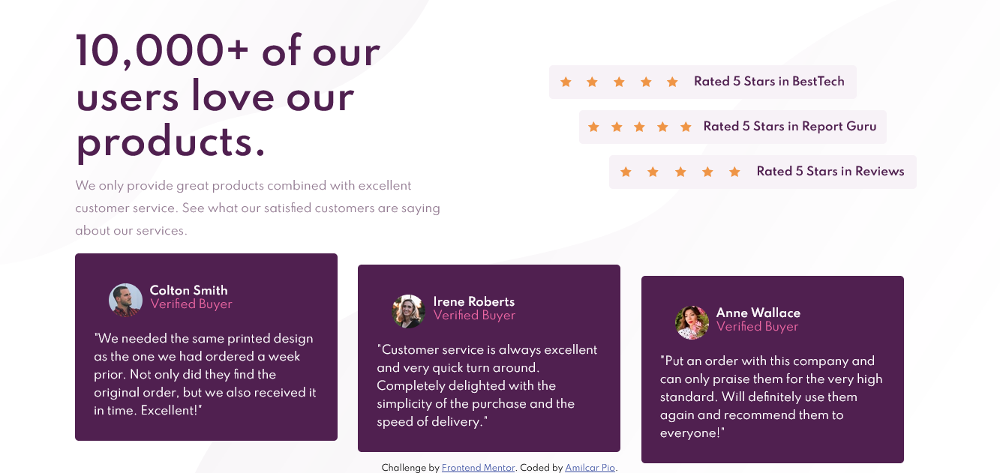
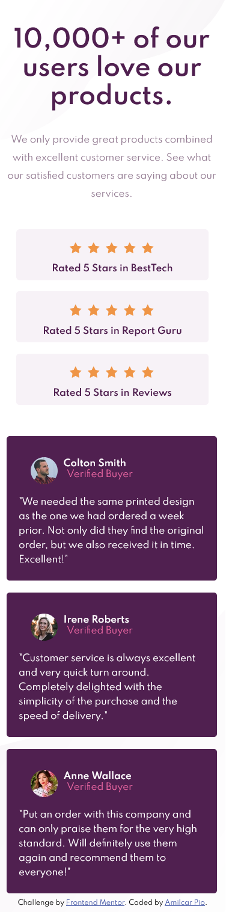

# Frontend Mentor - Social proof section solution

This is a solution to the [Social proof section challenge on Frontend Mentor](https://www.frontendmentor.io/challenges/social-proof-section-6e0qTv_bA). Frontend Mentor challenges help you improve your coding skills by building realistic projects. 

## Table of contents

- [Overview](#overview)
  - [The challenge](#the-challenge)
  - [Screenshot](#screenshot)
  - [Links](#links)
- [My process](#my-process)
  - [Built with](#built-with)
  - [What I learned](#what-i-learned)
  - [Continued development](#continued-development)
  - [Useful resources](#useful-resources)
- [Author](#author)

## Overview

### The challenge

Users should be able to:

- View the optimal layout for the section depending on their device's screen size

### Screenshot




### Links

- Solution URL: [GitHub Solution](https://github.com/Amilcarpio/social-proof-section)
- Live Site URL: [Live website](https://amilcarpio.github.io/social-proof-section/)

## My process

### Built with

- Semantic HTML5 markup
- CSS custom properties
- Flexbox
- CSS Grid
- Mobile-first workflow

### What I learned

The media queries properties was the most challenge for me, also put the stars above the list was a nightmare, but i'm proud to finish this project.

```css
.proud-of-this-css {
  @media (max-width: 480px) {
    .star-1 {
    position: relative;
    width: 20px;
    z-index: 1;
    left: 60px;
    top: 20px;
    }
```
### Continued development

I want to keep proving a better workflow schema, be more efficient and fast with the css and in the future invest on a css framework.

### Useful resources

- [Example resource 1](https://pt.stackoverflow.com/questions/333670/elemento-sobrepondo-o-outro-css) - This helped me to put the stars above the list div. I really liked this pattern and will use it going forward.
- [Example resource 2](https://developer.mozilla.org/pt-BR/docs/Web/CSS/Media_Queries/Using_media_queries) - This is an amazing article which helped me finally understand the media queries. I'd recommend it to anyone still learning this concept.

## Author

- Website - [Pio Web Design](https://www.piowebdesign.com)
- Frontend Mentor - [@amilcarpio](https://www.frontendmentor.io/profile/Amilcarpio)
- GitHub - [@amilcarpio](https://github.com/Amilcarpio)


